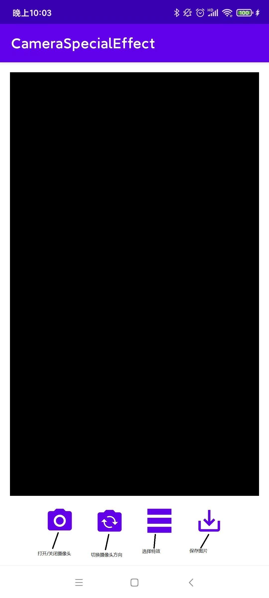
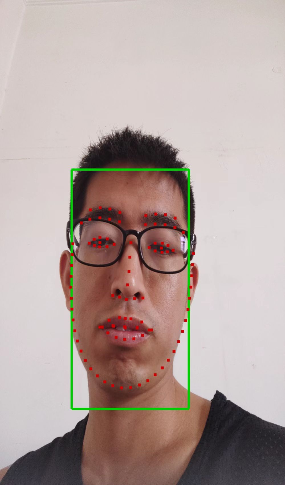
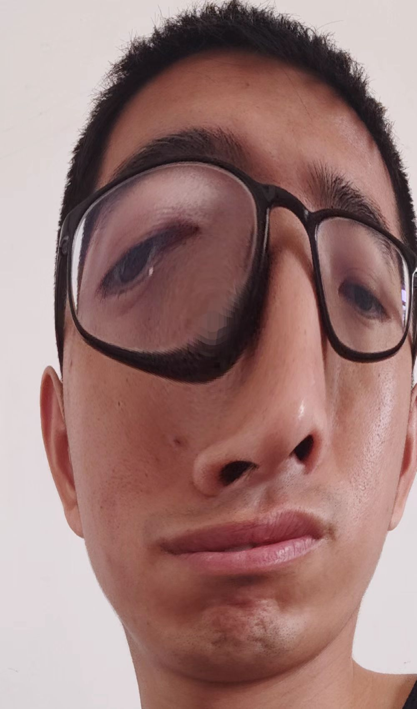
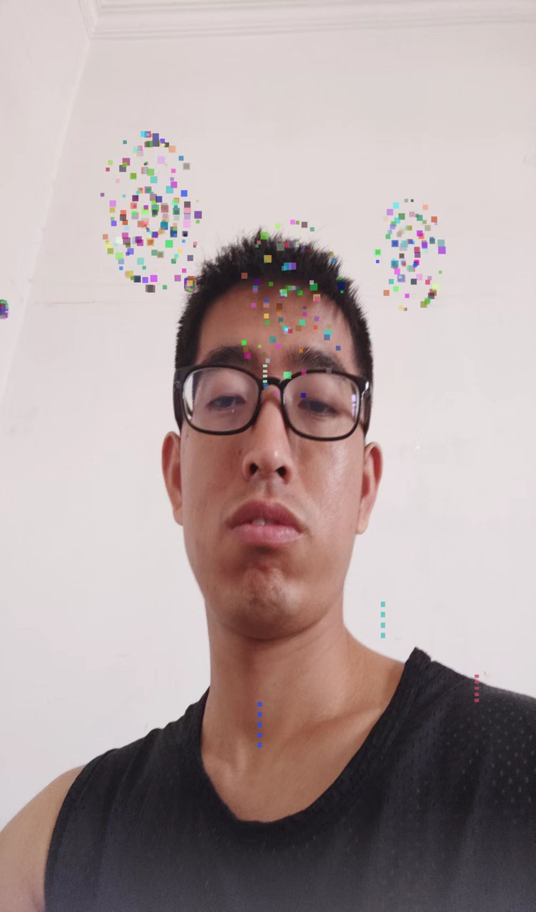
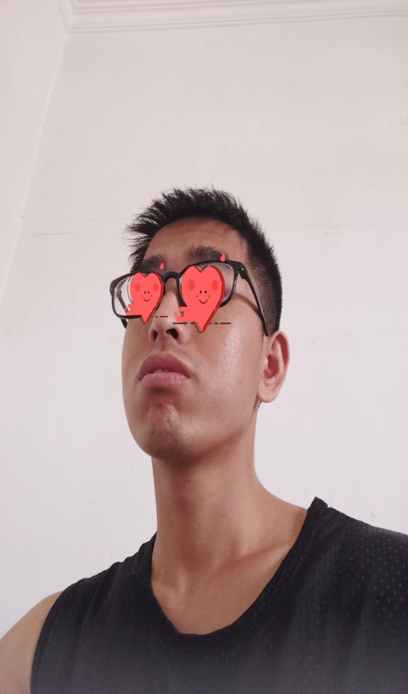
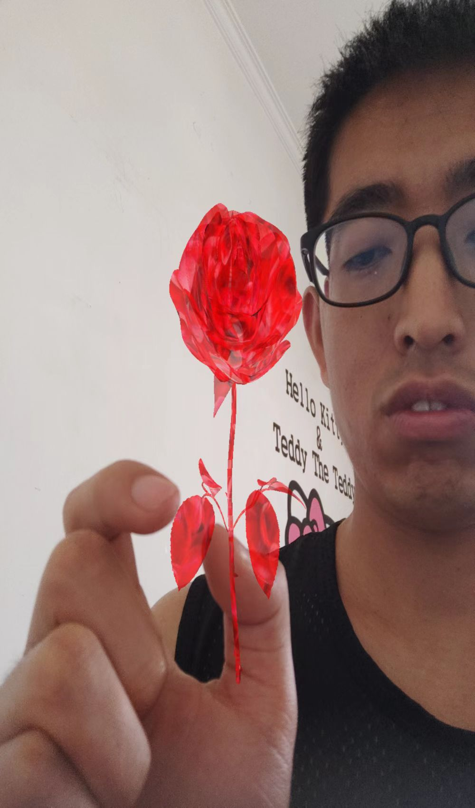

# CameraSpecialEffect

## 项目简介
本项目是基于opengles3开发的特效拍照app。技术栈主要是opengles3, 通过 c++ 实现cv算法和特效算法的封装，并通过Jni提供接口进行渲染。提供的特效种类包括: 原始视频渲染，人脸检测/关键点，双边滤波(美白)，大头特效，烟花，爱心贴图，3D对象，烟花2，风格迁移，虚拟背景。demo的预览视频连接见B站:https://www.bilibili.com/video/BV1XB4y197kZ?spm_id_from=333.1007.top_right_bar_window_history.content.click

## 开发环境
· Android 10 + java 1.8 + ndk24\
· 测试机器: Redmi k30 Pro\
· ncnn + opencv3 + mnn + glm + opengles 3

## UI 介绍

使用时，首先打开摄像头，然后选择特效种类，最后保存当前预览的图片即可(风格迁移除外，因为预览无法实现实时，点击保存之后去相册中查找即可)

## 每种特效简单讲解

### 原始视频渲染
渲染从摄像头中拿到的YUV数据，和渲染普通图像的流程一样

### 人脸检测/关键点
使用人脸检测和关键点检测算法，在帧的基础上绘制人脸框和关键点

### 双边滤波(美白)
glsl 编写双边滤波器，对视频进行美白(效果一般，视频变得模糊了)

### 大头特效
先进行人脸检测，以人脸框的中心进行形变，属于几何滤镜

### 烟花
基于 Opengles 中的点和线实现的烟花特效，简单的粒子特效，不好看但是都是基本元素

### 爱心贴图
进行人脸检测和关键点检测，将爱心的图像渲染到眼睛的位置

### 3D对象
加载 rose.obj 对象，渲染到手机屏幕中央

### 烟花2
基于图片的烟花特效，分两个阶段上升阶段和爆炸阶段。

### 风格迁移
基于快速风格迁移模型，由于模型运行速度慢(2000ms左右)，因此无法实时预览，可以点击保存按钮进行保存图像

### 虚拟背景
基于人像分割模型实现的虚拟背景特效，流程是先渲染帧，再将分割出的图像和背景图像渲染背景部分，实现虚拟背景的功能。

